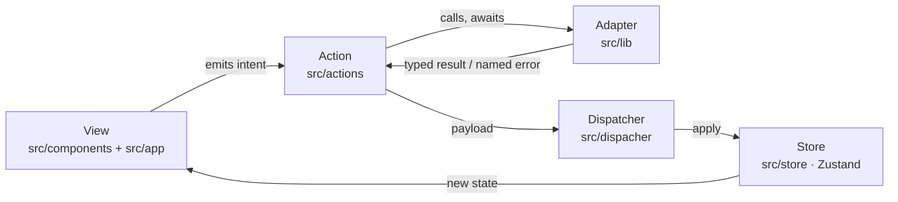

# Architecture

> This document defines the quality standard. Reviewer agents evaluate code against this file. If it is not written here, it is not a requirement.

## Context

**InsightAI** is an artificial-intelligence platform that lets non-technical people run data-analysis tasks and generate reports from natural language, on top of real data living in different SQL data sources. A user asks a question in plain language; the platform translates it, runs it against the appropriate source, and returns a report.

This repository is the **frontend** of that platform. It is a [Next.js](https://nextjs.org) (App Router) + React + TypeScript application. It owns no business rules about *how* data is analyzed — that lives in the backend microservices — but it owns the **interaction model**: how the user drives a request, how state evolves while that request is in flight, and how results are presented.

The frontend talks to two backend microservices over HTTP:

- **Core** (`http://localhost:8080`) — orchestration, sessions, report generation.
- **Detector** (`http://localhost:8081`) — natural-language / data-source detection.

Both expose OpenAPI/Swagger at `/api-docs`.

## Principles

1. **Unidirectional data flow (Flux)**: State changes travel in one direction only — `View → Action → Dispatcher → Store → View`. A component never mutates state directly and never calls another component's internals to force a change. It emits an intent (an action); the loop closes when the store re-renders the view. This makes every state transition traceable to a single named action.

2. **Ports & Adapters at the edges**: Anything that is *not* React and *not* our own domain — HTTP clients, backend APIs, browser APIs, third-party libraries — is reached **only** through an adapter in `src/lib/`. The rest of the app depends on the adapter's typed contract, never on the external library directly. Swapping the HTTP client, or a backend endpoint shape, must not ripple past `src/lib/`.

3. **Single Responsibility**: Each module, component, hook, action or store slice has one reason to change. UI components render and emit intents; they do not fetch, transform or persist. Actions orchestrate; they do not render. Adapters translate; they do not hold application state.

4. **Explicit, typed contracts**: The domain lives in `src/types/`. Functions that can fail (network error, malformed response, missing id) surface named, typed errors — they do not silently return `undefined` and let the caller guess. Every value crossing a layer boundary is typed against a contract in `src/types/`.

5. **Dependency direction points inward**: UI, actions, dispatchers and stores may depend on `src/types/` (the domain). The domain depends on nothing. Infrastructure concerns (adapters in `src/lib/`) implement the contracts defined by the domain — never the other way around. A component depending on an adapter does so through the contract the adapter fulfills, so the concrete implementation can change without touching the component.

## Layer map

The dependency rule below is unidirectional: an arrow `A → B` means "A may import B". Anything not listed is forbidden.

| Directory | Role | May depend on |
| --- | --- | --- |
| `src/types/` | **Domain** — contracts, models, enums, error types. The center of the app. | *(nothing)* |
| `src/store/` | **Flux stores** — global state, held in Zustand. The single source of truth for view state. | `types` |
| `src/dispacher/` | **Flux dispatchers** — the single choke point that routes actions to stores. | `types`, `store` |
| `src/actions/` | **Flux actions** — named intents + the orchestration to fulfill them (calling adapters, dispatching results). | `types`, `dispacher`, `lib` |
| `src/lib/` | **Adapters** — the only place that knows about HTTP, backend APIs, browser APIs and third-party libraries. | `types` |
| `src/hooks/` | **Utility hooks** — reusable React logic (selectors over stores, side-effect helpers). | `types`, `store`, `actions` |
| `src/components/` | **UI units** — reusable, presentational-first React components. | `types`, `hooks`, `actions`, `store` (read-only, via hooks) |
| `src/app/` | **Next.js App Router** — routing, layouts, pages; composes components. | everything above |

**The domain (`src/types/`) is the only layer allowed to have zero dependencies.** If a change to a backend endpoint forces a change in `src/types/`, that is expected; if it forces a change in `src/components/`, the adapter boundary has leaked.

## The Flux cycle

`src/actions`, `src/dispacher` and `src/store` together implement a classic **Flux** loop. This is the core of the application and every state transition must go through it. No component is allowed to mutate a store outside this loop.

Each participant obeys a single contract:

- **View (`src/components`, `src/app`)** — Reads state through hooks/selectors and emits **intents** by calling an action. It never mutates a store and never talks to `src/lib` directly. A component is dumb about *how* a request is fulfilled; it only knows *that* it asked.

- **Action (`src/actions`)** — A named intent (e.g. `generateReport`, `selectDataSource`). It orchestrates the work to fulfill the intent: it may call one or more adapters in `src/lib/`, await results, translate them into a store-shaped payload, and hand that payload to the dispatcher. Actions hold **orchestration**, not business logic and not rendering. An action is the only place allowed to reach infrastructure (`src/lib`) *and* the store loop in the same unit.

- **Dispatcher (`src/dispacher`)** — The single, narrow choke point through which every state change passes. It routes an action's payload to the right store update. Centralizing this keeps state transitions auditable: there is exactly one path a change can take. With Zustand, the dispatcher is the thin seam that decides *which* store `set` runs, so the store stays a plain state container and the routing logic stays in one file.

- **Store (`src/store`)** — Global state held in [Zustand](https://github.com/pmndrs/zustand). It is the **single source of truth** for view state. A store slice owns a coherent piece of state (e.g. the active session, the current report, request status) and exposes it plus its update surface. Stores are synchronous state containers: they hold no async work, no `fetch`, no orchestration — those belong in actions. Components subscribe to stores through selectors so they re-render only on the slice they use.

**Golden rule:** data flows one way. If you find yourself wanting a component to write to a store directly, or an action to render, or a store to call the network, the responsibility is in the wrong layer.

## Adapters (`src/lib/`)

`src/lib/` is the application's boundary with the outside world — the ports-and-adapters edge. Everything that is **not React and not our own domain** is wrapped here: the HTTP client, the Core and Detector API clients, and any third-party library that would otherwise be imported ad-hoc across the codebase.

Each adapter follows these principles:

- **Single external concern**: An adapter wraps one external dependency — one API surface, one library. The Core client does not know about the Detector client.

- **Domain-typed I/O**: An adapter accepts and returns types from `src/types/`, never the raw shapes of the external library or the wire format of the API. Translation between the external shape (a JSON response, a library's return type) and the domain contract happens **inside** the adapter and nowhere else. Callers depend on the contract, not on the library.

- **Explicit failure**: An adapter turns transport-level failures (non-2xx responses, timeouts, malformed bodies) into named, typed domain errors. Callers `catch` a known error type; they never inspect an HTTP status code or parse an error body — that stays inside the adapter.

- **No application state**: An adapter is stateless with respect to the Flux loop. It performs a translation and returns. It does not read or write stores; the calling action does that.

- **Replaceable**: Because the rest of the app depends only on an adapter's contract, the concrete implementation — the HTTP library, an endpoint's shape, even swapping a REST call for a mock in tests — can change without touching any consumer.

This is what keeps a backend change (a renamed field, a new error code, a different client library) contained to a single file in `src/lib/` instead of leaking into components, actions and stores.

## The domain (`src/types/`)

`src/types/` is the equivalent of the domain layer in a hexagonal architecture. It contains **only** contracts and models:

- Data models that describe the shapes the app reasons about (a report, a data source, a session, a query).
- Enums and discriminated unions for state (request status, error kinds).
- Named error types.
- Interfaces that adapters implement (the "ports").

It depends on **nothing** — not React, not Zustand, not the HTTP client. It is pure TypeScript. Every other layer is allowed to import from it, and the direction is never reversed. If a type is only meaningful to one component, it may live beside that component; but any type that crosses a layer boundary belongs here, so both sides agree on the same contract.

## Where new code goes

When adding a feature, classify the work before writing it:

- Rendering / user interaction → `src/components/` (reusable) or `src/app/` (route-specific composition).
- Reusable React logic (selectors, effect helpers) → `src/hooks/`.
- A new user intent that changes state → a new **action** in `src/actions/`, routed through `src/dispacher/`, landing in a slice of `src/store/`.
- Talking to Core, Detector, the browser, or any third-party library → an **adapter** in `src/lib/`.
- A new shape or contract shared across layers → `src/types/`.

If a piece of work seems to belong in two places, it is probably two responsibilities that should be split.
