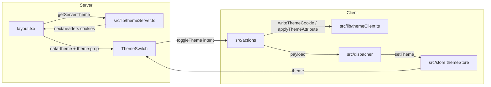

# Design — Theme Switch

References: `docs/architecture.md` (Flux + Ports & Adapters), `docs/conventions.md`,
`docs/ui.md`, `spec/theme-switch/figma_context.md`, `spec/theme-switch/codebase_context.md`.

Path alias throughout: `@app/*` → `./src/*`. The `@/` alias does **not** exist in this repo.

---

## 1. Architecture overview

The theme has two lifecycles that must be reconciled:

1. **Initial load (server, no flicker)** — `src/app/layout.tsx` (a server component) reads the
   theme cookie through a **server-only adapter**, applies `data-theme` to `<html>` during SSR,
   and passes the value down as the `theme` prop to the client `ThemeSwitch` leaf. Because the
   attribute is present in the server-rendered HTML, no flash occurs before hydration (R10, R11).

2. **Runtime toggle (client, Flux)** — The `ThemeSwitch` leaf is the only `'use client'`
   component. On activation it emits an **intent** to an action. The action persists the cookie
   and applies `data-theme` through a **client adapter**, then hands the new theme to the
   **dispatcher**, which routes it to the **store**. The store re-renders the switch (knob
   position + ARIA), closing the Flux loop: `View → Action → Dispatcher → Store → View` (R1, R5,
   R6, R7).



### Client/server boundary
- `'use client'` appears **only** in `src/components/nav/ThemeSwitch.tsx` (the smallest
  interactive leaf), per `docs/conventions.md` server-first rule.
- `src/lib/themeServer.ts` is guarded with `import 'server-only'`; `src/app/layout.tsx` stays a
  server component.
- `src/actions`, `src/dispacher`, `src/store`, `src/lib/themeClient.ts`, `src/hooks` are all
  synchronous, client-safe modules pulled into the client bundle by `ThemeSwitch`.

---

## 2. Files to create

| File | Purpose |
| --- | --- |
| `src/types/theme.ts` | `Theme` union, `THEME_COOKIE_KEY`, `DEFAULT_THEME`. |
| `src/types/index.ts` (modify) | Re-export the theme contracts. |
| `src/store/themeStore.ts` | Zustand slice holding `theme` + its update surface. |
| `src/store/index.ts` (modify) | Re-export `useThemeStore`. |
| `src/dispacher/index.ts` (modify) | `dispatchTheme` — the only path to the store's setter. |
| `src/actions/index.ts` (modify) | `toggleTheme`, `initTheme` intents. |
| `src/lib/themeClient.ts` | Client adapter: cookie write + `data-theme` application. |
| `src/lib/themeServer.ts` | Server-only adapter: read cookie via `next/headers`, dark fallback. |
| `src/lib/index.ts` (modify) | Re-export the **client** adapter only (see §6). |
| `src/hooks/useTheme.ts` | Selector hook over the theme store. |
| `src/hooks/index.ts` (modify) | Re-export `useTheme`. |
| `src/components/icons/theme.tsx` | Both theme icons in one file: `SunIcon` (node 8:107) and `MoonIcon` (node 8:103); imports `IconProps` from the barrel. |
| `src/components/icons/index.ts` (modify) | Define and export `IconProps`; re-export `SunIcon`, `MoonIcon`. |
| `src/components/nav/ThemeSwitch.tsx` | The client switch component (NOT barrelled). |
| `src/components/nav/themeSwitch.module.css` | Track/knob geometry, animation, colors. |
| `src/app/layout.tsx` (modify) | Read server theme, set `data-theme`, render `ThemeSwitch`. |
| `src/app/globals.css` (modify) | Full palette variable blocks (R12, R13). |

> Barrels that currently exist as 0-byte stubs are populated only where there is something to
> export (`docs/conventions.md`: a module with nothing to export has no barrel).

---

## 3. New contracts (signatures)

### `src/types/theme.ts`
```ts
export type Theme = 'dark' | 'light';
export const THEME_COOKIE_KEY = 'theme';
export const DEFAULT_THEME: Theme = 'dark';
```

### `src/store/themeStore.ts`
```ts
interface ThemeState {
  theme: Theme;
  setTheme: (theme: Theme) => void;
}
export const useThemeStore = create<ThemeState>(/* default: DEFAULT_THEME */);
```
The store is a plain synchronous container (R5, R23). Only the dispatcher calls `setTheme`.

### `src/dispacher/index.ts`
```ts
export const dispatchTheme = (theme: Theme): void; // routes to useThemeStore.setState
```
Single choke point for theme state changes (R6).

### `src/actions/index.ts`
```ts
export const toggleTheme = (): void;         // reads current from store, computes next, persists, applies, dispatches
export const initTheme = (theme: Theme): void; // seeds store from the SSR `theme` prop on mount
```
Actions orchestrate; they never render and never mutate the store directly (they go through the
dispatcher). `toggleTheme` reads the current value from the store, computes the opposite, calls
the client adapter to persist + apply, then dispatches (R1, R6, R7).

### `src/lib/themeClient.ts` (client-safe)
```ts
export const writeThemeCookie = (theme: Theme): void;      // document.cookie, ~1 year, path=/
export const applyThemeAttribute = (theme: Theme): void;   // document.documentElement.setAttribute('data-theme', theme)
```
Wraps the two browser APIs (cookie + DOM attribute) behind the adapter boundary (R8, R9).

### `src/lib/themeServer.ts` (server-only)
```ts
import 'server-only';
export const getServerTheme = async (): Promise<Theme>; // cookies() from next/headers; DEFAULT_THEME fallback
```
Wraps `next/headers` `cookies()`; returns `DEFAULT_THEME` when the cookie is absent or invalid
(R10, R11).

### `src/hooks/useTheme.ts`
```ts
export const useTheme = (): Theme; // selector over useThemeStore
```

### `src/components/icons/index.ts` — `IconProps` (defined in the barrel)
```ts
import { SVGProps } from 'react';
export interface IconProps extends SVGProps<SVGSVGElement> {
  color: string; // a CSS-variable token name, e.g. 'text', 'surface'
}
```
`IconProps` is defined and exported directly in the icons barrel; `theme.tsx` imports it from
`@app/components/icons`. Matches the `docs/ui.md` icon model:
`style={{ fill: 'rgb(var(--' + color + '))' }}` on the paths.

### `src/components/nav/ThemeSwitch.tsx`
```ts
'use client';
interface ThemeSwitchProps {
  theme: Theme; // initial theme from the cookie (R22)
}
```
On mount, calls `initTheme(props.theme)` (seeds the store to match SSR). Reads the live theme via
`useTheme()`. Renders a `<button role="switch" aria-checked={theme === 'light'} aria-label=...>`
containing the pill track, the sliding knob (`Ellipse`), and the `SunIcon`/`MoonIcon` icons. `onClick`
and `onKeyDown` (Enter/Space) emit `toggleTheme()` (R1, R14–R18).

---

## 4. Visual / CSS design (`themeSwitch.module.css` + `globals.css`)

Geometry from `figma_context.md` (pill 102×50, knob Ø40, insets 5px):
- Track: `width: 102px; height: 50px; border-radius: 25px; background: rgb(var(--border));`
- Knob (`Ellipse`): `width: 40px; height: 40px; border-radius: 50%; top: 5px; left: 5px;`
  `transform: translateX(0)` in light, `translateX(51px)` in dark, with
  `transition: transform 200ms ease` (R2).
- Knob fill/opacity: light → `rgb(var(--surface))`, opacity 1; dark → `rgb(var(--text-secondary))`,
  opacity 0.4.
- `SunIcon` / `MoonIcon` are positioned inside the track (10px insets, ~30px). Icon colors are
  passed via the `IconProps` `color` token, chosen from the current theme:
  - `SunIcon`: `dark → 'text-secondary'`, `light → 'text'`.
  - `MoonIcon`: `dark → 'background'`, `light → 'surface'`.
- The knob position is driven by the live store theme (a CSS class or `data-*` on the track),
  not by the `<html data-theme>` attribute, so the animation reflects the toggle immediately.

`globals.css` defines (verbatim from `docs/ui.md`, bare `R, G, B` triplets):
- `:root` — static: `--border`, `--turquoise`, `--indigo`, `--emerald`, `--red`.
- `[data-theme="dark"]` — `--blue`, `--orange`, `--background`, `--surface`, `--text`,
  `--text-secondary`.
- `[data-theme="light"]` — same names, light values.
- `body { background: rgb(var(--background)); color: rgb(var(--text)); }` so the theme applies
  globally (R9, R12, R13).

Responsiveness (R19): fixed 102×50 pill (50px height ≥ the 44px touch-target minimum) with no
horizontal-overflow risk; it sits in the nav and does not reflow. No media-query breakage because
its footprint is constant and small.

---

## 5. Data flow of the `theme` prop (server → client)

1. `layout.tsx` (server): `const theme = await getServerTheme();`
2. `<html lang="en" data-theme={theme} className={...roboto}>` — SSR sets the attribute (R10).
3. `<ThemeSwitch theme={theme} />` rendered inside the nav — the prop carries the cookie value to
   the client leaf (R22).
4. `ThemeSwitch` mount effect: `initTheme(theme)` seeds the Zustand store so client state equals
   SSR state (no hydration mismatch).
5. On toggle: `toggleTheme()` → adapter writes cookie + sets `data-theme` on `<html>` → dispatcher
   → store → re-render (knob slides, ARIA flips).

---

## 6. Points where the design borders the rules (required by `docs/spec.md`)

- **Single-barrel rule vs. server/client split.** `docs/conventions.md` says cross-module imports
  go through the module's `index.ts`. However, `src/lib/themeServer.ts` is `server-only`; if it
  were re-exported from `src/lib/index.ts`, any client component importing that barrel would crash
  at module load. **Decision:** `src/lib/index.ts` re-exports only the client adapter
  (`themeClient.ts`); `src/app/layout.tsx` imports `getServerTheme` directly from
  `@app/lib/themeServer`. This is a deliberate, documented exception justified by the
  server/client bundling boundary.
- **Barrel rule vs. R21 (not exported).** `ThemeSwitch` must **not** be exported from any barrel.
  Therefore `src/app/layout.tsx` imports it directly from
  `@app/components/nav/ThemeSwitch`. This intentional deep import is mandated by the requirement
  and overrides the "import through barrel" convention for this one component.
- **`docs/ui.md` alias error.** The doc's `@/components/icons` is wrong for this repo; the icons
  use `@app/components/icons`. Recorded so the implementer does not copy the broken alias.
- **Action reading store state.** `toggleTheme` reads the current theme from the store
  (`getState`) to compute the next value. This is orchestration (allowed in actions), not a
  direct mutation; the mutation still flows through the dispatcher.

---

## 7. Errors / exceptions

No network or transport is involved, so no new domain error types are added. The only failure
mode — a missing or malformed cookie — is handled by the `DEFAULT_THEME` (`dark`) fallback inside
`getServerTheme` (R11), not by throwing.

---

## 8. Alternatives considered and rejected

- **Persist the toggle via a Next Server Action (`'use server'`) instead of `document.cookie`.**
  Rejected: it adds a server round-trip on every toggle and delays the store/DOM update, hurting
  responsiveness. The client adapter writes the cookie synchronously; the server only needs it on
  the *next* request, which the client-written cookie already satisfies.
- **Persist to `localStorage` instead of a cookie.** Rejected: `localStorage` is unreadable during
  SSR, so the theme could not be applied server-side and flicker would return (violates R10).
- **Inline `<script>` in `<head>` to set `data-theme` before paint.** Rejected: the server cookie
  read already yields flicker-free SSR without shipping an inline script, and an inline script
  would hardcode logic outside the adapter boundary.
- **`next-themes` library.** Rejected: it owns its own state model and would bypass the mandated
  Flux loop and the `src/lib` adapter boundary (`docs/architecture.md`).
- **Apply `data-theme` with a store subscription in `layout` / a provider.** Rejected: layout is a
  server component; a client provider wrapping the whole tree would pull the app into the client
  bundle, violating the server-first rule. Applying the attribute inside the toggle action (via
  the adapter) keeps `'use client'` confined to the leaf.
- **CSS-only theme with `prefers-color-scheme`.** Rejected: cannot honor an explicit user
  preference persisted across sessions (R7) and cannot be toggled by the switch.
